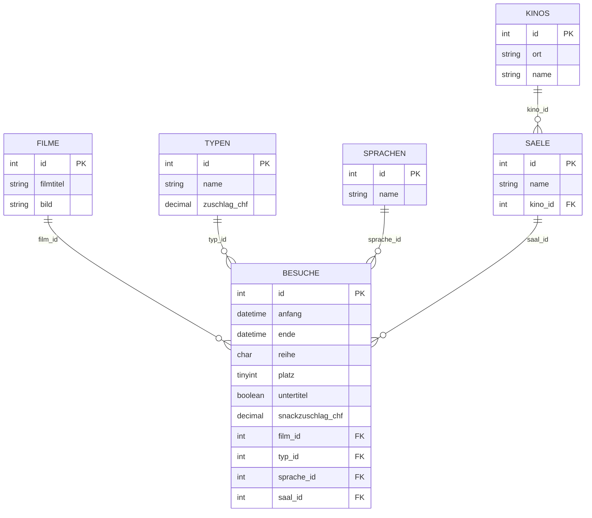

```mermaid
erDiagram
    BESUCHE {
        int id PK
        datetime anfang
        datetime ende
        char reihe
        tinyint platz
        boolean untertitel
        decimal snackzuschlag_chf
        int film_id FK
        int typ_id FK
        int sprache_id FK
        int saal_id FK
    }
    
    FILME {
        int id PK
        string filmtitel
        string bild
    }
    
    TYPEN {
        int id PK
        string name
        decimal zuschlag_chf
    }
    
    SPRACHEN {
        int id PK
        string name
    }
    
    SAELE {
        int id PK
        string name
        int kino_id FK
    }
    
    KINOS {
        int id PK
        string ort
        string name
    }
    
    FILME ||--o{ BESUCHE : "film_id"
    TYPEN ||--o{ BESUCHE : "typ_id"
    SPRACHEN ||--o{ BESUCHE : "sprache_id"
    SAELE ||--o{ BESUCHE : "saal_id"
    KINOS ||--o{ SAELE : "kino_id"
```